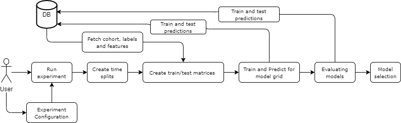
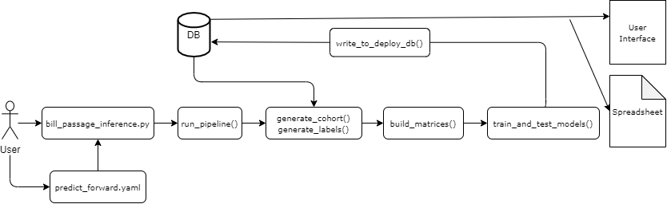

# Predicting the Likelihood of Bill Passage

The goal of the analysis, is to accurately predict the likelihood of a bill being passed into law, for a given bill. This coupled with the _topic area classificaion_ can help the ACLU (and other advocacy organizations) determine where to target their advocacy resources.  

We stratified the prediction task interms of time, and geography. In terms of time, we are developing models for short-term predictions and long-term predictions and in terms of geography, we are developing models that consider all state legislatures as a whole, and models that are targeted for each state legislature. 

### Short-term versus Long-term Bill Passage Prediction

In the short-term predictions, the model predicts the likelihood of the bill being passed into law in the immediate future, e.g. next week/month, while in the long-term predictions, the model predicts the likelihood of the bill being passed into law in the given legislative session.
Both scores can be important to prioritize their resources.

### State-wise models versus country-wide model

State legislatures vary significantly across the country in their size, legislative process, session length, bill passage success rates, and data availability. 
This variability suggests that modeling efforts specialized to a specific state could potentially better results.
As an initial step, we are training models that consider data from all states.
Parallelly, we are picking several states to develop more specialized state-wise models as well. 

### Analytical Formulation 

**Cohort Definition**: 
Each week, the model will score all the bills that are active (that hasn't been passed/failed in a vote/vetoed) and has had some acitivity in the _last_ two months. 

For the country-wide model bills from the whole country is considered in the cohort, and for state-wise models, only the bills from their respective state is considered in the cohort.

**Label Definition**: 
The label will indicate whether the bill will be passed into law in a certain timespan in the future.

In the short-term models, the timespan is set to _one month_, while in the long term models it is set to _one year_.

### Features

The models are trained with features that capture the context around the bill and its content.
The context of the bill is captured by including the following information:
- Bill information such as its type, the introduced chamber, and its age
- Information about the events that the bill has gone through
- Information about the legislative make up with respect to parties
- Information about bill sponsors
- Information about the bill content

<!-- - Text features (TF-IDF, Wordvectors)
- Sponsors (frac of dems/rep, num of sponsors)
- Num. of amendments (Amendment "size", somehow to capture how much it was changed)
- Voting info (Number of roll calls, percentage support, percentage against, abstained)
- State
- Bill/Resolution
- Legislature makeup -->

 
<!-- E.g. as of date: 2017-05-09, and using projects that had an event yesterday, and label_window is 1 month

`with cohort as (
    select distinct bill_id from raw.bill_events where event_date = '2017-05-08'::timestamp
) 
select * from raw.bills inner join cohort using (bill_id) 
where status='4' and status_date < '2017-06-08'::timestamp;` -->

### Train and Evaluate Models

The model trainng and evaluation was conducted using [Triage](https://github.com/dssg/triage/), a general purpose modeling framework for risk modeling in public policy contexts.
A configuration file is used to set up the components of the experiment. The configuration files used for experimentatation are [here](https://github.com/dssg/aclu_leg_tracker/tree/master/src/bill_passage/triage_config).
The details about setting up triage configuration files are [here](https://dssg.github.io/triage/quickstart/#3-set-up-triage-configuration-files).

Triage is used to:

- Create the temporal data splits for temporal validation
- Generate the train-test matrices using the provided cohort, label and feature definitions
- Train and evaluate the ML model grid

This setup is used to predict both the long-term and short-term passage models and select the models that will be used to predict forward. 

### Predict Forward

We predict the short-term and long-term passage likelihood of active legislative bills every week using the selected models. The `bill_passage_inference.py` is used to run the predict forward pipeline. 
Each week, models are retrained using the most recent historical data. Then, the retrained models are used to predict the short-term and long-term passage likelihoods for active bill as of the prediction dates. 
This pipeline leverages components of Triage to perform the following:

- Generate cohort, features, and labels for training matrix
- Train the models
- Predict forward.

Once the predicted scores are written to the DB, the scores are made available to the public through a user interface and a dwnloadable spreadsheet.

