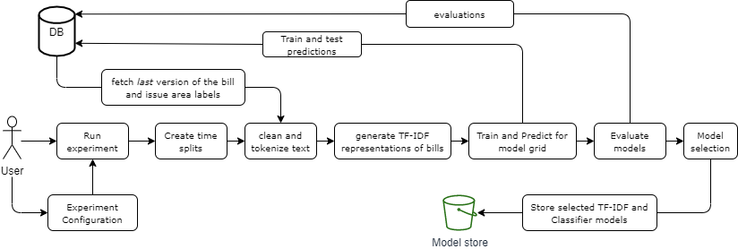
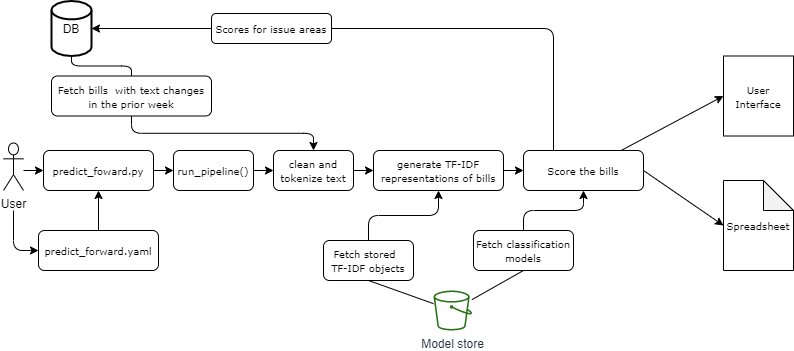

# Classification of Bills into their Issue Areas

Advocacy organization such as the ACLU work across a multitude of topic/issue areas such as criminal justice, immigrants' rights, and LGBTQ rights. 
In this analysis we are building classification models that categorizes legislative bills into the issue areas. 

In the current iteration of the models, we are concerned with six main issue areas that ACLU is working on:
- Immigrants' rights
- Reproductive right
- Criminal justice 
- LGBTQ rights
- technology and privacy
- Racial Justice

We created six binary classifiers for each issue area to perform _one-versus-all_ type classification.

##  Analytical Formulation

**Cohort:** As with the [bill passage prediction model](bill_passage.md), we expect to run this model weekly, and as the cohort we select: 
- New bills introduced in the week before
- Bills that had a change in its text in the week before

**Label**: As we train a model per issue area, the labels are binary, and is TRUE if the bill belongs to the relevant issue area (A bill can belong to multiple issue areas).

Unlike the bill passage model, we are not predicting the likelihood of an event in the future. We are simply categorizing bills into their issue areas at the time of prediction.

## Features

This analysis is based on the content of the legislative bills. Therefore, we use text based features to represent the bill content to the ML model. 
In this current iteration we use TF-IDF weighted Bag-of-words representation. 

## How we label the data for training models

In the current iteration, we get the "ground truth" data for training the classification models using Elasticsearch. We compiled a set of keywords for each issue area, and used the search capability in Elasticsearch to fetch the relevant bills for those keywords. We labeled these labels as belonging to the issue area in question. As we said above, a bill could belong to several issue areas.  

**Keywords we used**

| Issue area | Keywords we used for search |
| ---------- | --------------------------- |
| Immigrants' rights | Immigrants' rights, immigrant, sanctuary cities, undocumented|
| Voting rights | voter protection, main-vote, voting ights |
| Criminal law reform | criminal law, criminal justice, policing, policy brutality, felony |
| Racial justice | racial justice, segregation, police brutality, housing | 
| privacy and technology | digital footprint, data privacy | 

Idaelly, the labels should be acquired by experts labeling the bills and assigning them to respective issue areas. We used the above labeling method for the initial version of the models, and in future iterations we plan to obtain labels from experts and retrain models. 

## Train and Evaluate Models

Even though we are not predicting a future event, we still need to take the temporal dependencies into account when training and evaluating models as we use information available to us at the time of prediction, to assign issue areas to a bill at the current time. The context around issue area is not stationary. For instance, the language surrounding an issue area (e.g., commonly used words) changes with time. Therefore when training models, the cross-validation setup is similar to the one of bill passage. We use the triage component [Timechop](https://github.com/dssg/triage/tree/master/src/triage/component/timechop) to create the temporal splits for creating train/test features for cross validation. Each temporal split has a set of modeling dates (`as_of_date`), and we fetch the cohort and label for each `as_of_date` (Bills that were introduced, or changed in the week prior). The latest version of the bill with respect to the `as_of_date` is used as the text for the bill. 

The experiment is setup using a configuration file. The configuration files we used for testing are given [here](https://github.com/dssg/aclu_leg_tracker/tree/master/src/issue_classifier/experiment_config)

This set following setup is used to train and evaluate ML models for issue area classification

After running this pipeline for a range of model objects we select six model groups and model objects (one each for issue area) to be used for predicting forward. In addition to the classifiers, we select the TF-IDF feature type that contributed to best performance and store the trained object. 

## Predict Forward

We generate scores for the above given issue areas everyweek. Unlike with the bill passage model, we do not retrain the models every week. We will periodically retrain the models when new ground truth labels becomes available for the new bills. 

The following pipeline is used to predict forward. 

