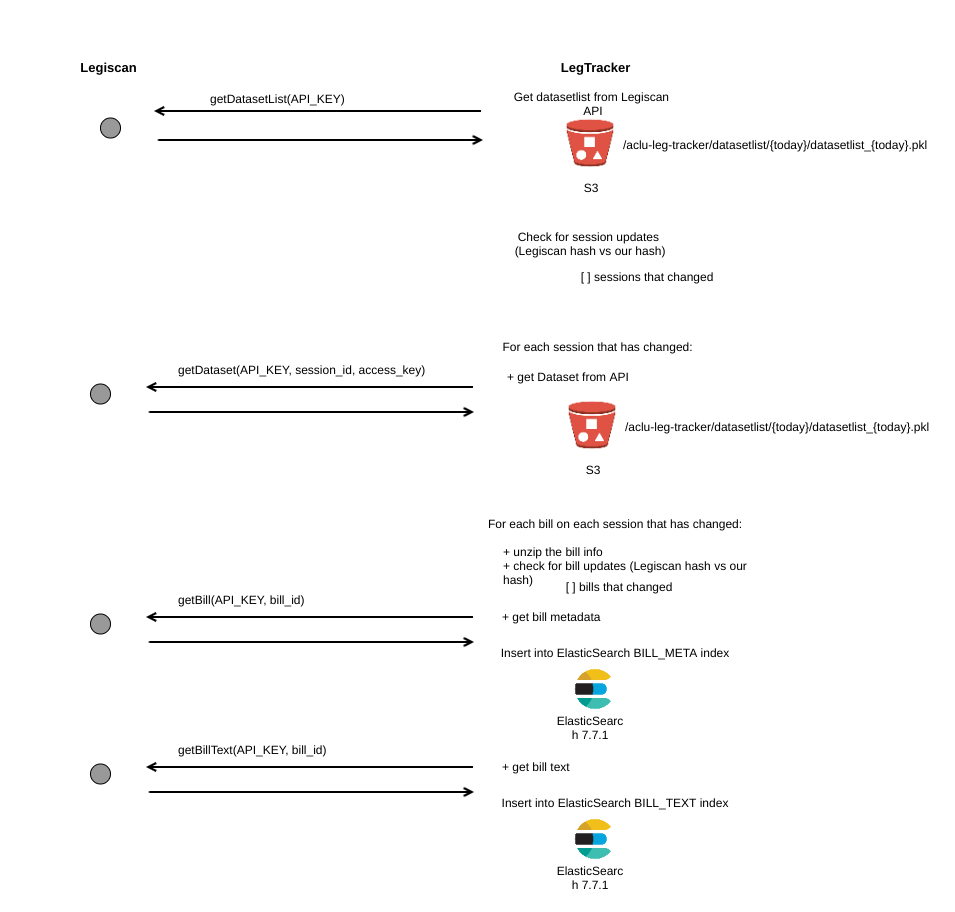
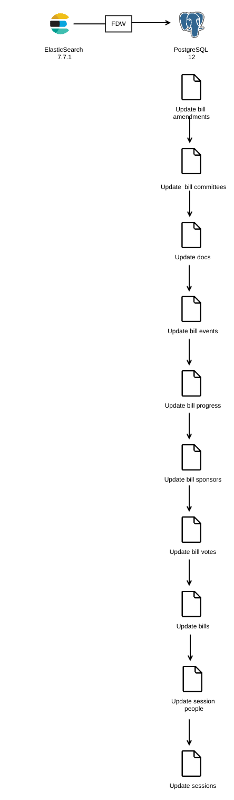

## Update data pipeline from LegiScan 

* Frequency: Each week 
* Input: LegiScan API, different endpoints at different stages
* Output: Bills and bill context data updated on the previous week on
 PostgreSQL database tables and ElasticSearch documents. 
 
 ### General Process 
 
 Data in Legiscan is organized by states, each state has its own legislative
  session, and each session has different bills. 
 
 Legiscan tracks changes been made on each of the bills including their
  content and metadata such as sponsors, votes, committees, etc. If a bill
   has a change on its content or metadata, Legiscan updates the hash associated
    to it, and also changes
    the session hash from which this bill belongs to. 
    
This pipeline takes advantage of the use of session and bills hashes. 

#### Steps 

1. Get the "active" sessions from last week from Legiscan. 
2. Check which sessions from those that are active have actually been
 modified. We make a comparison between the hashes that Legiscan has for each
  "active" session vs our hashes. 
3. For those sessions that the hash doesn't match we ask Legiscan for all the
 bills that have. 
4. Check which bills have had a change from last week by comparing Legiscan
 hash with our hash. 
5. For those bills that had changed, we get from Legiscan its metadata and
 its text content. 
6. We update the ElasticSearch cluster with the metadata and text of the
 bills that changed.
7. We update the metadata of the updated bills on Postgres.  
8. We update the hash of the session modified. 
9. We update the hash of the bills that were updated.   
  
 
  
 
 ### PostgreSQL update from ElasticSearch 
 
 
  